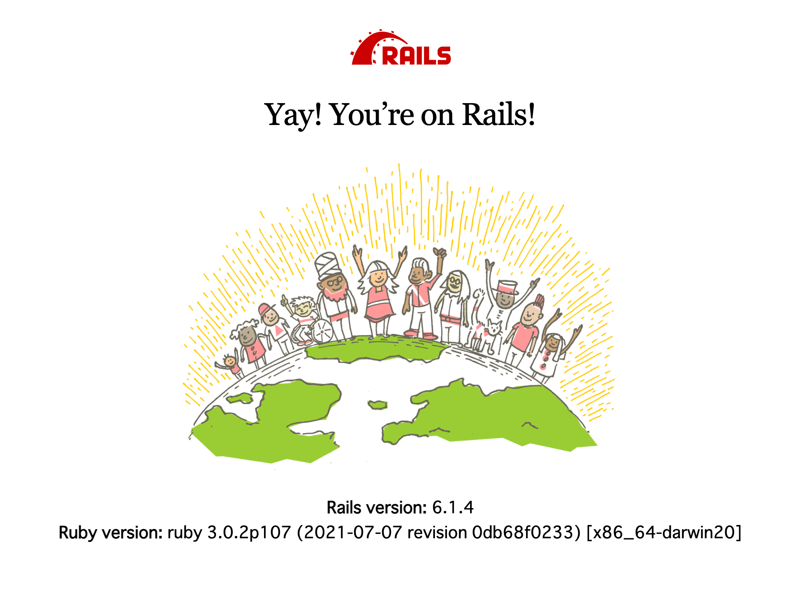

# 開発環境の準備

minimart API の開発は `minimart` ディレクトリで行います。

```console
$ cd minimart
```

minimart API の開発に必要な MySQL と minifinancier は [`docker-compose`](https://docs.docker.com/compose/) を使用して起動します（終了は `docker-compose down` です）。

```console
$ docker-compose up -d
Creating network "minimart_default" with the default driver
Creating volume "minimart_mysql-data" with default driver
Creating minimart_minifinancier_1 ... done
Creating minimart_mysql_1         ... done
```

起動できたら、[`bin/setup`](../minimart/bin/setup) を実行して依存 gem のインストールやデータベースの準備をします。
このスクリプトはべき等なので、開発環境にトラブルが生じた際は `bin/setup` を実行してみてください。
以下の実行例は2回目以降のものです。

```console
$ bin/setup
== Installing dependencies ==
The Gemfile's dependencies are satisfied

== Preparing database ==
ridgepole --config config/database.yml --env development --file db/Schemafile --mysql-change-table-options --apply
Apply `db/Schemafile`
No change
ridgepole --config config/database.yml --env test --file db/Schemafile --mysql-change-table-options --apply
Apply `db/Schemafile`
No change

== Removing old logs and tempfiles ==

== Restarting application server ==
```

無事完了したら、`bundle exec rails server` を実行してアプリケーションサーバーを起動します。
ちなみに、[`bin/rails`](../minimart/bin/rails) は `bundle exec rails` と同等で、`rails server` は `rails s` と省略可能なので、`bin/rails s` でタイプ数を少なく済ませられます。

```console
$ bundle exec rails server
=> Booting Puma
=> Rails 6.1.4 application starting in development 
=> Run `bin/rails server --help` for more startup options
Puma starting in single mode...
* Puma version: 5.3.2 (ruby 3.0.2-p107) ("Sweetnighter")
*  Min threads: 5
*  Max threads: 5
*  Environment: development
*          PID: 123456
* Listening on http://127.0.0.1:3000
* Listening on http://[::1]:3000
Use Ctrl-C to stop
```

http://localhost:3000 を開いて以下のような画面が表示されたら開発環境の準備は完了です。



---

[ハンズオンへ](02-hands-on.md)
